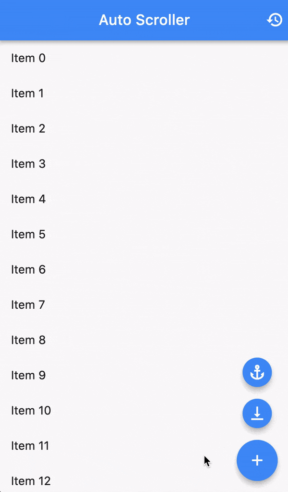

# auto_scroll
A flexible auto-scrolling widget for Flutter.



## Features
- Works with any `ScrollView`
- Implicitly animated
- Responds correctly to widget resizes
- Imperative manual controls through an `AutoScrollController`
- Highly configurable

## Usage
### Quick start
1. Import the package
   ```dart
   import 'package:auto_scroll/auto_scroll.dart';
   ```

2. Use the widget with any `ScrollView`
   ```dart
   final items = [1, 2, 3, 4];
   
   return AutoScroller(
     lengthIdentifier: items.length,
     anchorThreshold: 24,
     startAnchored: false,
     builder: (context, controller) {
       return ListView.builder(
         controller: controller,
         itemCount: items.length,
         itemBuilder: (context, index) =>
             ListTile(title: Text('Item ${items[index]}')),
       );
     },
   );
   ```

### Advanced usage
An advanced usage example is [provided](example/lib/main.dart).
